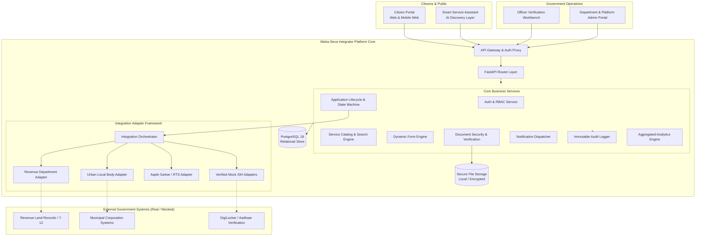
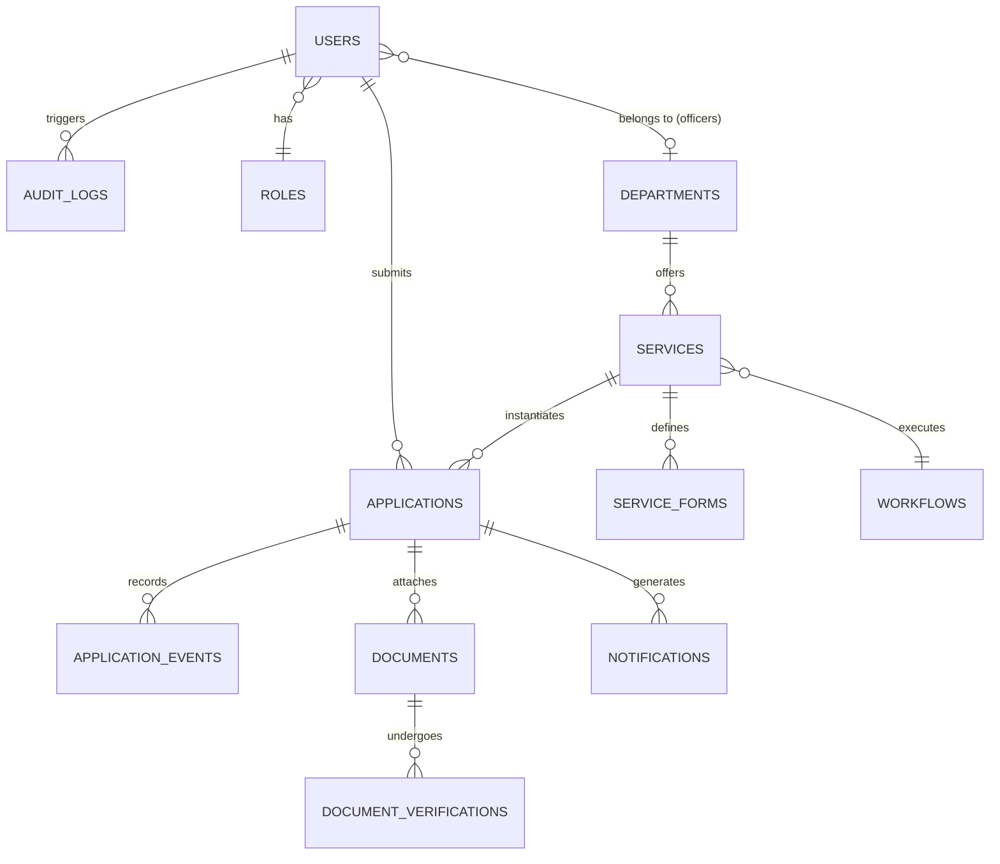
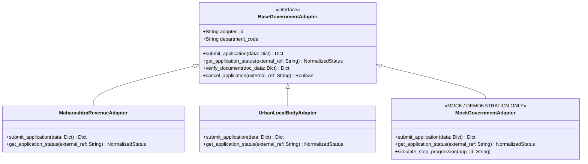

# Maha-Seva Integrator — Technical Architecture Document

**Hackathon:** Smart India Hackathon 2026  
**Problem Statement:** SIH 2026 — PS-129 (SIH26129)  
**Organization:** Government of Maharashtra  
**Theme:** Smart Automation / Software Interoperability  
**Project:** Maha-Seva Integrator (Digital Government Service Orchestration Platform)  
**Status:** Architecture Blueprint (Milestone 0)  

---

## 1. System Overview

**Maha-Seva Integrator** is an enterprise-grade digital government service orchestration platform designed to address the fragmentation of public service delivery in Maharashtra. Currently, citizens must navigate separate portals (Revenue, Municipal, Rural Development, Labour, Transport) with duplicate registrations, disparate verification processes, and zero cross-departmental visibility.

Maha-Seva Integrator acts as the unified middleware and orchestration layer that:
1. Presents a single, accessible, multilingual (English / मराठी) citizen gateway.
2. Dynamically drives service discovery, eligibility checking, and application submission.
3. Decouples core platform logic from external government departments via a pluggable **Integration Adapter Framework**.
4. Synchronizes statuses in near real-time across departmental silos.
5. Provides government officers with role-scoped verification workbenches.
6. Delivers end-to-end transparency, immutable audit logs, and citizen notifications.



---

## 2. Frontend Architecture

The frontend is designed as an accessible, high-trust, responsive single-page application built using modern web standards:

- **Framework:** React 18 / Vite with TypeScript for strict type-safety and rapid rendering.
- **Styling & UI System:** Tailwind CSS paired with Lucide-React icons, adhering to Indian Digital Public Service UI guidelines (clear typography, high contrast, clean cards, accessible status indicators).
- **Internationalization (i18n):** `i18next` with complete English and Marathi (`मराठी`) language packs.
- **State Management:** Lightweight React Context + TanStack Query (React Query) for server state caching and optimistic UI updates.
- **Form Rendering:** Schema-driven dynamic form engine rendering inputs, validation feedback, and conditional fields based on service JSON schemas.
- **Accessibility (a11y):** WCAG 2.1 AA compliance, ARIA attributes, full keyboard navigation, high contrast focus states, and screen-reader friendly structure.

### Key Layouts & Route Guards:
1. **Public Layout:** Header with language switcher, emergency helpline banner, accessible search, footer with government disclaimers.
2. **Citizen Portal:** Authenticated layout with dashboard, active applications, track application, digital locker/documents, and notifications.
3. **Officer Portal:** Department-scoped sidebar, operational queue, application detail workbench with document viewer, remark editor, and status transition triggers.
4. **Super Admin Portal:** Platform metrics, department & service configuration, adapter monitoring, and audit log explorer.

---

## 3. Backend Architecture

The backend follows a layered, domain-driven clean architecture in Python with FastAPI:

```text
HTTP Request
     │
     ▼
[Middleware Layer]  ──> (CORS, Security Headers, Request ID, Rate Limiter, Timing)
     │
     ▼
[Router Layer]      ──> (FastAPI routers, endpoint definitions, query parsing, DTO binding)
     │
     ▼
[Service Layer]     ──> (Core domain rules, state transitions, validation, orchestration)
     │
     ├───► [Repository Layer] ──> (SQLAlchemy models, PostgreSQL transactions)
     │
     ├───► [Integration Adapters] ──> (External government API communication)
     │
     └───► [Audit & Notification Dispatchers]
```

### Layer Separation Principles:
- **Routers** contain NO business logic; they only validate HTTP requests and marshal responses.
- **Services** coordinate workflows, enforce role permissions, trigger status changes, and dispatch events.
- **Repositories** encapsulate raw database queries and prevent ORM leakage into business layers.
- **Adapters** isolate external system communication.

---

## 4. Database Architecture

PostgreSQL 18 relational schema structured with strict foreign keys, constraints, and performance indexes.

### Core Entity Relationship:



### Database Tables:
1. `roles`: Role definitions (`CITIZEN`, `OFFICER`, `DEPARTMENT_ADMIN`, `SUPER_ADMIN`).
2. `users`: Unified user credentials, phone, email, full name, role ID, department ID (for officers), active status.
3. `departments`: Government departments (e.g., Revenue & Forest, Urban Development, Rural Development, Public Health).
4. `service_categories`: Classification (Certificates, Revenue, Welfare, Licenses, Land Records).
5. `services`: Service catalog metadata, department ID, category ID, SLA days, fee, workflow ID, adapter identifier.
6. `service_forms`: Dynamic JSON schemas defining form fields, validation constraints, and file requirements per service.
7. `workflows`: State machine configurations defining allowed status transitions per service.
8. `applications`: Application instance with unique application number (e.g. `MH-REV-2026-00491`), citizen ID, service ID, status, form response data (JSONB).
9. `application_events`: Immutable timeline of every status transition with actor, timestamp, and officer remarks.
10. `documents`: Uploaded document metadata, MIME type, storage path, file hash.
11. `document_verifications`: Officer review status (`VERIFIED`, `REJECTED`, `RESUBMISSION_REQUIRED`) with rejection reasons.
12. `notifications`: In-app notification queue with read status and event triggers.
13. `audit_logs`: Immutable security audit trails for compliance.

---

## 5. Authentication & Authorization (RBAC)

- **Authentication:** Stateless JSON Web Tokens (JWT) signed with HMAC-SHA256 (`HS256`).
- **Token Payload:** Contains `sub` (User ID), `email`, `role`, `department_id`, and `exp`.
- **Password Security:** Salted Bcrypt with adaptive work factor (minimum 12 rounds).
- **Authorization Guard:** FastAPI Dependency-based RBAC (`require_roles(["OFFICER", "DEPARTMENT_ADMIN"])`).
- **Data Isolation:**
  - Citizens can ONLY query their own applications.
  - Officers can ONLY query applications belonging to their assigned `department_id`.
  - Super Admins have cross-departmental oversight with explicit audit logging.

---

## 6. Integration Architecture (The Core Innovation)

To solve PS-129 (system interoperability), Maha-Seva Integrator implements an **Integration Adapter Framework**:



### Key Principles:
1. Core application logic NEVER invokes external endpoints directly.
2. Each adapter translates internal standardized payloads into department-specific formats (REST, SOAP/XML, or JSON-RPC).
3. Responses are normalized into standard platform objects (`NormalizedApplicationStatus`, `NormalizedDocumentStatus`).
4. **Demonstration Mode:** Realistic mock adapters simulate external government processing delays, acknowledgments, and document verification without requiring live production government credentials during hackathon evaluation.

---

## 7. Notification Architecture

- **Supported Channels:** `IN_APP` (core prototype), designed for extension to `SMS`, `EMAIL`, and `WHATSAPP`.
- **Event-Driven Triggers:**
  - `APPLICATION_SUBMITTED`
  - `DOCUMENT_VERIFIED` / `DOCUMENT_REJECTED`
  - `ADDITIONAL_INFO_REQUIRED`
  - `STATUS_CHANGED`
  - `APPLICATION_APPROVED` / `APPLICATION_REJECTED`
  - `CERTIFICATE_ISSUED`
- **Delivery Strategy:** Asynchronous internal event dispatch to avoid blocking user transactions.

---

## 8. Document Architecture

- **Storage Engine:** Pluggable document store (Local Secure Disk for SIH demo, swappable to AWS S3 / Azure Blob / DigiLocker Government Gateway).
- **Validation Pipeline:**
  1. File size limit enforcement (max 5MB per document).
  2. Whitelisted MIME check (`application/pdf`, `image/jpeg`, `image/png`).
  3. SHA-256 checksum generation for file integrity verification.
  4. Sanitized non-guessable storage naming (`UUID.ext`).
- **Access Control:** Documents are NEVER served via unauthenticated static URLs. Downloads require authenticated token-based authorization checking citizen ownership or officer department scope.

---

## 9. Audit Architecture

Every administrative, operational, or status-altering action generates an immutable audit record:

| Field | Description |
| :--- | :--- |
| `id` | Unique sequential integer / UUID |
| `actor_id` | User ID of the actor initiating the operation |
| `role` | Role of actor at execution time |
| `action` | Action descriptor (e.g., `DOCUMENT_VERIFIED`, `STATUS_TRANSITION`) |
| `entity_type` | Target domain entity (`APPLICATION`, `DOCUMENT`, `SERVICE`) |
| `entity_id` | Target entity identifier |
| `ip_address` | Client IP address |
| `metadata` | JSON payload recording old state, new state, and remarks |
| `created_at` | Immutable UTC timestamp |

---

## 10. Security Architecture

1. **Input Validation:** Strict Pydantic v2 schemas validating all request bodies and sanitizing string fields against XSS.
2. **SQL Injection Defense:** 100% parameterized queries via SQLAlchemy ORM; no raw concatenated SQL.
3. **Transport & Headers:** CORS restricted to configured frontend origins; Security Headers (`X-Content-Type-Options: nosniff`, `X-Frame-Options: DENY`, `Content-Security-Policy`).
4. **Secret Management:** Secrets loaded exclusively from environment variables (`.env`); `.env.example` provided for safe onboarding.
5. **No Secret Commits:** Git rules and `.gitignore` preventing token/credential leaks.

---

## 11. API Architecture

RESTful conventions versioned under `/api/v1/`:

- `POST /api/v1/auth/register` — Citizen registration
- `POST /api/v1/auth/login` — Citizen & Officer JWT authentication
- `GET /api/v1/auth/me` — Current authenticated user profile
- `GET /api/v1/departments` — List active government departments
- `GET /api/v1/services` — Discover services (with search, category, department filters)
- `GET /api/v1/services/{id}` — Retrieve service details & dynamic form schema
- `POST /api/v1/applications` — Submit new service application
- `GET /api/v1/applications/my` — Citizen application history
- `GET /api/v1/applications/{number}/track` — Public/authenticated application tracking
- `POST /api/v1/documents/upload` — Upload application supporting document
- `GET /api/v1/officer/applications` — Officer department application queue
- `PATCH /api/v1/officer/applications/{id}/status` — Officer status transition
- `POST /api/v1/officer/documents/{id}/verify` — Verify/reject submitted document
- `GET /api/v1/admin/analytics/overview` — Super admin & department KPI telemetry
- `GET /api/v1/admin/audit-logs` — Immutable compliance audit stream

---

## 12. End-to-End User Workflows

### A. Citizen Flow
```text
Citizen Visits Portal (EN/MR)
   ├──> Search / Browse Services (or consult Smart Service Assistant)
   ├──> Review Eligibility & Required Documents
   ├──> Authenticate / Register
   ├──> Fill Dynamic Form (Bilingual fields, instant validation)
   ├──> Upload Supporting Documents (Aadhaar, Income Proof, etc.)
   ├──> Review & Submit
   ├──> Receive Unique Application Number (e.g. MH-REV-2026-00491)
   └──> Track Status in Real-Time & Receive In-App Alerts
```

### B. Government Officer Flow
```text
Officer Logins with Department Credentials (e.g., Revenue Dept)
   ├──> View Department Queue (Filter by status, SLA priority, date)
   ├──> Select Pending Application
   ├──> Inspect Citizen Data & Form Responses
   ├──> Review & Verify Attached Documents
   ├──> Take Action:
   │       ├── Verify Documents -> Advance to Processing
   │       ├── Request Additional Info / Document Resubmission
   │       └── Approve / Reject Application with Official Remarks
   └──> System dispatches notification and logs audit trail
```

### C. Administrator Flow
```text
Super Admin / Department Admin Logins
   ├──> Review Cross-Department Telemetry (Volume, Backlog, SLA times)
   ├──> Configure / Update Services and Dynamic Form Schemas
   ├──> Inspect Integration Adapter Health & Sync Status
   └──> Review Immutable Audit Trails for Transparency and Compliance
```
